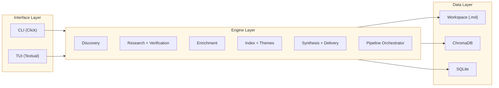

```
:,,....,,.,,,:::;;iiii;ii;::;iiii;i;,............................,,,,....,,,,,,,,.............. ....  ......................................
,.......,,::::,,,,,.,,,::;;;;;;i;:;..............................,,,,...,,,,,,,,,...........................................................
,.......,:;:;;,,:::............,,,,,.....,,,,,......,............,.,,...,,,,,,,,,...,.......,.............................  .. .....  ...,,,
,......,,,,,,:::::,,,,....................,,,,,,,,,.....,,........,,...,,,,,,,:,.....................,;IlI;,.......... ..  .. ........,,,,..
.......,,,,,,.,,,,,.......,......,......,,,::::,,,....,,.,......,,,,,,.,,,,,,,,,............,,,...,,,;<≠√≠>;,.......................,,,,,,,,
.........,,.,,,...........................,;;::,..................,,,...,,,,,,,.....................:l=∑∂≤+;...............:iI;:::,,,,,...,.
,,........,,............................,;>±÷>i,...................,,..,,,,,,...................,,,:l÷≥∑≥×l,..............;+≠≤=l:,,,.,,.,,..
.... .......,........,,,................,I÷∫√≠×!:..........,:II;,.............................,i+×>l!±≥±>;,..............,I+≤∑±+I:,,,,,,,,..
... ...............,<÷÷÷=..,.,::::::::,..,I+≠∂∑=I::::::::,.;+∑∂≈I,..,::::::::::,........,:::::;<≥∂≤+i;;:,,:::::,......,,:::;>×≤≥÷!:,,,.....,
..................,l×××=;.;+;<>=××÷÷÷±=,,,:i!<!>≠÷÷÷÷××÷÷=!l>≠∑÷i,,:<÷÷÷×==÷÷÷÷-l:....,i=±÷÷÷±-!<<ll≈=;..;=÷÷××+;......;=>><<+∑∫≠<:.,.,,,::,
...... ...........<××÷×>..:××÷×-××÷÷÷-=≈-I-≥≠>;!±÷÷÷÷÷÷÷÷±÷×÷-;.l×÷÷÷÷÷÷>+÷÷××÷÷×l,.l×÷÷÷÷÷÷÷±+;::;<×=;.;-××××××i.....;=×lII:ii;:,...,:,,.,
.................;====+:..;×=+×=liiiii<÷!l×√≤+;!±××÷-iiiii;;ii;,.!±÷÷±+II;;ii>÷÷÷÷!..<±÷÷±>iiiIi>≠=!-÷×i.;-××××××-l,...;=÷<!I..,,,::,::,,,,,
.......,,...,....!×××=I ..;÷×××-:.....:<±×+-!:,l±×=×< ...........!≈÷÷≈÷-<;,..l×÷÷÷!,.<÷÷÷÷l....,;>±±÷÷×i.;-×××××××-;...;-==×=,..,,,,,,,,,,,,
................;-==×+....;××××=:.....,!÷÷÷×l..I÷×-+<...........:<±±=>≠∂≠!:..:iIII:..<÷÷÷÷l......i=÷÷××i.;-××==×××=-:..;-×××=,........,...,,
...............:>==-+:....;×===-;:::::i+×=×=l..l×>!<=××--=××>.,I=÷×±-l!>!;,..........<÷××÷l......i-×××=i.;-×===I+==×<:.;-===-,.......,,,,,,,
,...,..........>--=+:.....:=-+--====××=====-I..I=-+!+=-++===<..;<-×÷=×<,,,...........<×=×÷l......i-=-!!:.;-=->+::+=--<:;---=-,.......,,,,,,,
.....,........I++-+l......;=------------==+;...I×-==-+++++++!...,!÷--=!,;!<l:........!=--=l,:::,.i+=>++;.;+--l<:.I>----l--+--,..,,.,..,,,,,,
.......,,,...:++>>l.......:-++++i;;l=-++!I.....I=+++!............l×--=!;-≥∂≈l;iiii:..!--+li!±≥÷l,i>++-+;.:>>!>+:..I>++++++>++,...:,.,,,,,,,:
......;>±÷l,,<>>><: ......:+<>>>,..,l>>>+>,....:!+><I............I-<!>l,I+=<;!-+>+I..l+>-+l!≈∑±l,:l!<<>;.:<><>>:...i<<<<<<<<>,...,,...,,.,,,
.....,i×√∑!:I!!!<<........;-<<<<,...;<>>>+<....:!<>>!............I-<<>l..,,..l+<<>I..l+<<-l:;;;,.;!<<<>;.:<<!!>:....I!!<<<!!>, .,,,,,,,,.,,,
......,;ii,:!lll!.........,,,;-!,....:>!!<<I...,,,I<!!++----+-<:.I+!!!>------!l!<>I,.l>!!!+××-+-++<!!<<:.:l!!!<:.....l!!llll>,.,,:,,,,,.,,,:
...........ilIl<:......:l>>I:;=<,.....;<!!!<l.,il;,i-!!!!!!!!!l:..:!<!!!!!!!!!!!>liIi:I<<!!!II;il!!!!i...:!!ll!,......:llll<-;I!<i:,,,,,:,::
...... ...;lIIli.......i=∂∫×Ii=-:.....,I+++>l.i×∑=:i-+++++++++!,....I++++!l++++l:!≠∂≤+i,!-==-+++I<+>;....,<>++>:.......:<>!,;<≥∫∑+i,,,,,,:,,
.........ilIII,........,I><!>≠∑≠l,..........:il!i:..............................,I=≠√∫±l,...........,,...........,.......,:<≠√∫≠÷<;,,,,,,,::
.........,::::............,:!±≠±l,.........,!≈∫≥+;...:iIi:.......................,i+≠√±l,......,,,,......,,....,,,.,,,,,,,:l÷≠≠-l;,,,,,,:::;
............................,;;:,..........,I-≠±<;,,:!±∫≤>:.....,..................:;i;,.....,,,:,,,,,,,,,,,,,,,,,,,,,,,,.,:iIi;:,,,,,,,::;,
... ..,..,.......,,..,,,,,..,,,,...........,,;;;:,,.:!±≥≈!:....................,,:::,,,.....,:,,,,,,,,,,,,,,,,:,,,,,,,,,,,,,,,,,,,,::::::;;:
.....,.,.,.,,,,,,,,.,,,,...,,,.,,,........,.,,,,,,,,,::;i:................,,.,iiII;::,,:;ii;:,.;:,,,,,,,,:::::,,,,,,,,,::,,,,,,,,::,,::;;i;;
......,,,:....,,,.,,,,,,,,,,,:,,,,,,,..,..,.,,,,,..,,:,,,,:,............,,...:I=÷+I:,;:,,.....,;:,,,,::,::::::,,:::;:,,,,,..,,,,:::::;;;ii;;
......,,,:.,,,,..,,,,,,:,,,,:,,,,...,,..,,,,.,,,,,,,.:;,,,,,,:,........,,.,,;;;IlIi;,.,,,,,,,,::,,,,,,,::;;:,,,:;;;;:,,:,,,:,,,::::;:;iiiIii
......,,,:.,,,..,,.,,,:::::,,:;:,,,,,,,,,,,,,,,,,,,...,::,,,,,,,,,,,:,......:::;;:,..,:;::::;i:,,,,,,,:::;;,,,:;;;:::;::;::;:,,::::;i;iiiiii
.....,,,,:......,.,,,,:::::,::::::,,,,,,,,,,,,,,,,,....,,::::,,.,,.,,,,,,:;i;::,,...,::::::;:,,,,,,,,:::;;;:,,,;;;::::;;;;;;::::;::;iiiiiiiI
```

A CLI and TUI for competitive intelligence research. Recon orchestrates LLM agents to discover competitors, research them section-by-section against a structured schema, verify findings through multi-agent consensus, and synthesize the results into thematic analyses and executive summaries -- all stored locally as Obsidian-compatible markdown.

## Dependencies and setup

**Requires Python 3.11+** and an [Anthropic API key](https://console.anthropic.com/) for LLM-powered features.

```bash
# Clone and install
git clone <repo-url> && cd recon
python3 -m venv .venv
source .venv/bin/activate
pip install -e ".[dev]"

# Set your API key
export ANTHROPIC_API_KEY=sk-ant-...

# Verify
pytest tests/ -q
recon --version
```

### Core dependencies

| Package | Purpose |
|---------|---------|
| [click](https://click.palletsprojects.com/) | CLI framework |
| [textual](https://textual.textualize.io/) | Terminal UI (warm amber retro aesthetic) |
| [anthropic](https://docs.anthropic.com/en/api) | Claude API client (async) |
| [chromadb](https://docs.trychroma.com/) | Local vector database for semantic search |
| [fastembed](https://qdrant.github.io/fastembed/) | Local embedding model (no API calls for indexing) |
| [pydantic](https://docs.pydantic.dev/) v2 | Schema validation |
| [aiosqlite](https://aiosqlite.omnilib.dev/) | Async SQLite for run/task state |
| [python-frontmatter](https://python-frontmatter.readthedocs.io/) | YAML frontmatter in markdown profiles |

### Dev dependencies

pytest, pytest-asyncio, pytest-cov, ruff

## How it works

Recon is schema-driven. A `recon.yaml` file defines every aspect of the research: sections, allowed output formats, rating scales, source preferences, and verification tiers. Worker prompts are auto-generated from this schema at composition time -- there are no hardcoded prompts.

The pipeline has 8 phases:

```mermaid
graph LR
    A[Discover] --> B[Research]
    B --> C[Verify]
    C --> D[Enrich]
    D --> E[Index]
    E --> F[Themes]
    F --> G[Synthesize]
    G --> H[Deliver]

    style A fill:#fff7e6,stroke:#c88a2e,color:#333
    style B fill:#fff7e6,stroke:#c88a2e,color:#333
    style C fill:#fff7e6,stroke:#c88a2e,color:#333
    style D fill:#fff7e6,stroke:#c88a2e,color:#333
    style E fill:#fff7e6,stroke:#c88a2e,color:#333
    style F fill:#fff7e6,stroke:#c88a2e,color:#333
    style G fill:#fff7e6,stroke:#c88a2e,color:#333
    style H fill:#fff7e6,stroke:#c88a2e,color:#333
```



**1. Discover** -- An LLM agent searches for competitors in batches. Users review candidates, toggle accept/reject, and the agent refines its search based on the pattern. Deduplication by URL domain across rounds.

**2. Research** -- Section-by-section batching across all competitors (not competitor-by-competitor). Each section is researched for every competitor before moving to the next, which produces more consistent and comparable output.

**3. Verify** -- Multi-agent consensus at three tiers: standard (single pass), verified (2-agent agreement), and deep (3-agent + reconciliation). Verification tier is set per-section in the schema.

**4. Enrich** -- Three progressive passes over the raw research: format cleanup (fix structure, sources, tables), developer sentiment (community perception, NPS signals), and strategic analysis (moats, risks, trajectory).

**5. Index** -- Profiles are chunked by section, embedded locally with fastembed, and stored in ChromaDB. Incremental indexing via SHA-256 file hashes in SQLite skips unchanged files on re-runs.

**6. Discover themes** -- K-means clustering on the embeddings surfaces themes from the data (not user-defined). Themes are ranked by evidence strength. Users curate: toggle, rename, investigate topics the clustering missed.

**7. Synthesize** -- Single-pass or deep 4-pass mode. Deep synthesis runs four agents in sequence: strategist, devil's advocate, gap analyst, and executive integrator. Each pass builds on the previous.

**8. Deliver** -- Distills each theme into an executive 1-pager, then runs cross-theme meta-synthesis to produce the final executive summary.

### Architecture

Three layers with strict separation:



All LLM calls go through a single async client wrapper with token counting. The worker pool uses semaphore-controlled concurrency. The pipeline orchestrator tracks state in SQLite so runs can resume from any phase.

## What it does

### CLI commands

```bash
# Workspace setup
recon init <dir> --domain "Developer Tools" --company "Acme" --products "Acme CI"
recon add "Cursor"                    # add a competitor
recon add "Acme CI" --own-product     # research your own product through the same lens
recon status                          # workspace dashboard

# Discovery
recon discover --rounds 3 --seed "VS Code" --seed "Cursor"
recon discover --auto-accept          # non-interactive mode

# Research and enrichment
recon research --all --dry-run        # preview research plan
recon research --all --workers 10     # run with 10 parallel workers
recon enrich --all --pass cleanup     # format cleanup pass
recon enrich --all --pass sentiment   # developer sentiment pass
recon enrich --all --pass strategic   # strategic analysis pass

# Indexing and search
recon index                           # incremental by default
recon index --full                    # re-index everything
recon retrieve --query "pricing model" --n-results 20

# Theme discovery and tagging
recon tag --n-themes 7                # discover themes and tag profiles
recon tag --dry-run --threshold 0.4   # preview tag assignments

# Synthesis and delivery
recon synthesize --theme "Platform Consolidation"
recon synthesize --theme "Developer Experience" --deep
recon distill --theme all
recon summarize                       # cross-theme executive summary

# Full pipeline
recon run --dry-run                   # show plan + cost estimate
recon run                             # execute everything
recon run --from research --deep      # resume from a stage, deep synthesis

# TUI
recon tui                             # interactive terminal UI
```

### Profiles are plain markdown

Every competitor is a markdown file with YAML frontmatter, compatible with Obsidian and any markdown editor:

```markdown
---
name: Cursor
type: competitor
research_status: verified
domain: Developer Tools
themes:
  - AI-First Development
  - Developer Experience
---

## Overview

AI-native code editor built on VS Code...

## Capabilities

| Dimension | Rating | Evidence |
|-----------|--------|----------|
| ...       | ...    | ...      |
```

## Modules

| Module | Purpose |
|--------|---------|
| `schema.py` | Pydantic v2 schema parser -- the backbone |
| `workspace.py` | Workspace init, profile CRUD, Obsidian-compatible markdown |
| `state.py` | Async SQLite state store (runs, tasks, file hashes, costs) |
| `prompts.py` | Composable prompt assembly from schema metadata |
| `validation.py` | Deterministic format checks (emoji, sources, tables, word counts) |
| `cost.py` | Token estimation, model pricing, verification tier multipliers |
| `llm.py` | Async Anthropic client wrapper with usage tracking |
| `client_factory.py` | API key validation and client creation |
| `workers.py` | Semaphore-controlled async worker pool |
| `research.py` | Section-by-section research orchestrator |
| `verification.py` | Multi-agent consensus (standard/verified/deep) |
| `enrichment.py` | Cleanup, sentiment, and strategic enrichment passes |
| `index.py` | Markdown chunking + ChromaDB vector index + semantic retrieval |
| `incremental.py` | SHA-256 hash-based incremental indexing |
| `themes.py` | K-means clustering theme discovery (custom, no sklearn) |
| `tag.py` | Theme tagging via retrieval relevance aggregation |
| `synthesis.py` | Single-pass + deep 4-pass synthesis engine |
| `deliver.py` | Distillation + cross-theme meta-synthesis |
| `discovery.py` | Iterative competitor discovery with LLM agent |
| `pipeline.py` | Full pipeline orchestrator with state tracking |
| `tui/app.py` | Textual app with view switching (dashboard/themes/monitor) |
| `tui/theme.py` | Warm amber retro terminal theme |
| `tui/screens.py` | Dashboard data preparation |
| `tui/widgets.py` | Status panel, competitor table, progress bar, curation/monitor panels |
| `tui/curation.py` | Theme curation data model (toggle, rename, filter by strength) |
| `tui/monitor.py` | Run monitor data model (phase, workers, cost, activity feed) |

## Development

```bash
# Run tests (363 tests, ~10s)
pytest tests/ -q

# Run with coverage
pytest tests/ --cov=recon --cov-report=term-missing

# Lint
ruff check src/ tests/

# Type check (optional)
mypy src/recon/
```

TDD is non-negotiable. Every line of production code responds to a failing test.

## Design docs

Full design documentation lives in [`design/`](design/):

| Document | Covers |
|----------|--------|
| [`design/README.md`](design/README.md) | Design principles (schema-driven, verification-first, local-first) |
| [`design/pipeline.md`](design/pipeline.md) | 8-phase pipeline, state machine, phase dependencies |
| [`design/architecture.md`](design/architecture.md) | Three-layer architecture, TUI design, SQLite state schema |
| [`design/research-and-verification.md`](design/research-and-verification.md) | Section-by-section batching, multi-agent consensus protocol, format constraints |
| [`design/setup-and-discovery.md`](design/setup-and-discovery.md) | Discovery flow, schema wizard, theme discovery, own-product research |
| [`design/operations.md`](design/operations.md) | Run planner, incremental runs, diff updates, cost estimation |

## License

MIT
