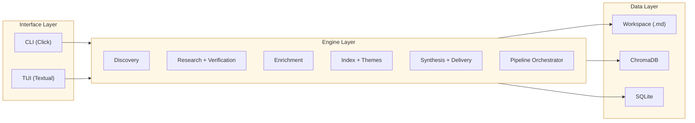

```
░▒▓███████▓▒░░▒▓████████▓▒░▒▓██████▓▒░ ░▒▓██████▓▒░░▒▓███████▓▒░  
░▒▓█▓▒░░▒▓█▓▒░▒▓█▓▒░     ░▒▓█▓▒░░▒▓█▓▒░▒▓█▓▒░░▒▓█▓▒░▒▓█▓▒░░▒▓█▓▒░ 
░▒▓█▓▒░░▒▓█▓▒░▒▓█▓▒░     ░▒▓█▓▒░      ░▒▓█▓▒░░▒▓█▓▒░▒▓█▓▒░░▒▓█▓▒░ 
░▒▓███████▓▒░░▒▓██████▓▒░░▒▓█▓▒░      ░▒▓█▓▒░░▒▓█▓▒░▒▓█▓▒░░▒▓█▓▒░ 
░▒▓█▓▒░░▒▓█▓▒░▒▓█▓▒░     ░▒▓█▓▒░      ░▒▓█▓▒░░▒▓█▓▒░▒▓█▓▒░░▒▓█▓▒░ 
░▒▓█▓▒░░▒▓█▓▒░▒▓█▓▒░     ░▒▓█▓▒░░▒▓█▓▒░▒▓█▓▒░░▒▓█▓▒░▒▓█▓▒░░▒▓█▓▒░ 
░▒▓█▓▒░░▒▓█▓▒░▒▓████████▓▒░▒▓██████▓▒░ ░▒▓██████▓▒░░▒▓█▓▒░░▒▓█▓▒░
```

A CLI and TUI for competitive intelligence research. Recon orchestrates LLM agents to discover competitors, research them section-by-section against a structured schema, and synthesize the results into thematic analyses and executive summaries -- all stored locally as Obsidian-compatible markdown.

> **Status: v0.1 (alpha).** Both the CLI and the TUI can now run the full pipeline end-to-end against the live Anthropic API. See [`design/wiring-audit.md`](design/wiring-audit.md) for the wiring audit and [`CHANGELOG.md`](CHANGELOG.md) for what's fixed since the initial alpha.

## Status

| Component | State | Notes |
|---|---|---|
| Engine layer (pipeline, research, verification, enrichment, index, themes, synthesis, deliver, discovery, tag) | **Stable** | 600+ unit tests, 25+ integration tests, lint clean |
| `recon init` / `add` / `status` | **Stable** | Headless init produces full 8-section default schema |
| `recon discover` | **Stable** | Uses `web_search_20250305` tool for live competitor discovery |
| `recon research [target | --all]` | **Stable** | Target argument honored; tracks per-section `researched_at` timestamps in frontmatter |
| `recon diff [target | --all] --max-age-days N` | **Stable** | Re-research only sections older than the staleness window |
| `recon rerun [target | --all]` | **Stable** | Retry only sections marked `failed` or never researched |
| `recon enrich [target | --all]` | **Stable** | Target argument honored; unknown names error clearly |
| `recon verify [target | --all] [--tier ...]` | **Stable** | Per-section verification honoring schema tiers; writes summary to profile frontmatter |
| `recon index` / `retrieve` | **Stable** | Local fastembed + ChromaDB, incremental via SHA-256 hashes |
| `recon tag` | **Stable** | K-means clustering with async LLM-generated theme labels (mechanical TF-IDF fallback when no LLM client) |
| `recon synthesize` / `distill` / `summarize` | **Stable** | Single-pass + deep 4-pass synthesis, distillation, meta-synthesis |
| `recon run` (full pipeline) | **Stable** | End-to-end: research → verify → enrich → index → themes → synthesize → deliver |
| TUI: persistent chrome | **Stable** | Header bar (workspace context), ActivityFeed (typed engine events), LogPane (raw log tail), RunStatusBar (1-line status during runs), KeybindHint strip |
| TUI: keyboard-first navigation | **Stable** | All full screens use keybinds (r/d/b/e/m on dashboard, p/s/b on run, n/o/1-9 on welcome). Escape closes all modals. Ctrl+C exits. No action-bar buttons. |
| TUI: welcome / wizard / dashboard | **Stable** | Welcome with recent projects (1-9 digit keys), wizard 4-step scaffold, dashboard with TerminalBox card stack layout, `e` opens `recon.yaml` in $EDITOR |
| TUI: discovery (DataTable) | **Stable** | Candidates render in a scrollable DataTable. Arrow keys navigate, Enter toggles accept/reject. Duplicate project guard wipes old profiles on reinit. |
| TUI: competitor browser | **Stable** | DataTable with detail panel. `b` or `escape` to return. |
| TUI: planner → pipeline execution | **Stable** | All 7 planner operations call the real engine via `pipeline_runner.py`. `ReconApp.launch_pipeline` is the canonical entry point. |
| TUI: competitor grid run monitor | **Stable** | Per-competitor ASCII progress bars (████░░░░), failed counts, active section indicators (>> Pricing), worker panel, elapsed time + running cost. Subscribes to EventBus in real time. |
| TUI: pause / stop / cancel | **Stable** | Pause/resume via asyncio.Event semaphore. Stop sets cancel event. Both work mid-run. |
| TUI: theme curation gate | **Working** | Pipeline gate pushes ThemeCurationScreen mid-run. Toggle themes on/off, synthesize selected. Theme labels still use mechanical fallback (fastembed integration pending). |
| Real-terminal PTY smoke tests | **Stable** | 25 tests spawn `recon tui` in a real PTY, press real keys, assert on rendered output. Covers every screen's primary keybinds + edge cases. |
| Real-API E2E tests | **Available** | Opt-in via `ANTHROPIC_API_KEY`, tests in `tests/test_e2e_real.py` |
| Web UI: `recon serve` (FastAPI + Alpine.js) | **Alpha** | Local loopback server, hash router, Welcome/Describe/Discovery/Template/Confirm screens shipped. Dashboard/Run/Results/Curation/Browser/Selector are placeholder routes (TUI-only until later phases). 84 web tests passing. See [`design/web-ui-spec.md`](design/web-ui-spec.md). |
| Web UI: styling pass | **Stable** | Inter 4.0 (UI) + JetBrains Mono (data/code) hybrid, Lucide icons via `iconify-icon`, cyberspace.online Dark-theme palette, clickable flow-progress nav. Reference captures in [`docs/screenshots/`](docs/screenshots/). |

## Install

**Requires Python 3.11+** and an [Anthropic API key](https://console.anthropic.com/) for LLM-powered features.

### From PyPI (end users)

```bash
pip install recon-cli
export ANTHROPIC_API_KEY=sk-ant-...
recon --version
```

### From source (contributors)

```bash
git clone https://github.com/mpacione/recon.git
cd recon
python3 -m venv .venv
source .venv/bin/activate
pip install -e ".[dev]"

export ANTHROPIC_API_KEY=sk-ant-...
pytest tests/ -q
recon --version
```

See [`docs/getting-started.md`](docs/getting-started.md) for a
hands-on walkthrough from fresh install to executive summary.

### Core dependencies

| Package | Purpose |
|---------|---------|
| [click](https://click.palletsprojects.com/) | CLI framework |
| [textual](https://textual.textualize.io/) | Terminal UI (warm amber retro aesthetic) |
| [anthropic](https://docs.anthropic.com/en/api) | Claude API client (async) |
| [chromadb](https://docs.trychroma.com/) | Local vector database for semantic search |
| [fastembed](https://qdrant.github.io/fastembed/) | Local embedding model (no API calls for indexing) |
| [pydantic](https://docs.pydantic.dev/) v2 | Schema validation |
| [aiosqlite](https://aiosqlite.omnilib.dev/) | Async SQLite for run/task state |
| [python-frontmatter](https://python-frontmatter.readthedocs.io/) | YAML frontmatter in markdown profiles |

### Dev dependencies

pytest, pytest-asyncio, pytest-cov, ruff

## How it works

Recon is schema-driven. A `recon.yaml` file defines every aspect of the research: sections, allowed output formats, rating scales, source preferences, and verification tiers. Worker prompts are auto-generated from this schema at composition time -- there are no hardcoded prompts.

The pipeline has 8 phases:

```mermaid
graph LR
    A[Discover] --> B[Research]
    B --> C[Verify]
    C --> D[Enrich]
    D --> E[Index]
    E --> F[Themes]
    F --> G[Synthesize]
    G --> H[Deliver]

    style A fill:#fff7e6,stroke:#c88a2e,color:#333
    style B fill:#fff7e6,stroke:#c88a2e,color:#333
    style C fill:#fff7e6,stroke:#c88a2e,color:#333
    style D fill:#fff7e6,stroke:#c88a2e,color:#333
    style E fill:#fff7e6,stroke:#c88a2e,color:#333
    style F fill:#fff7e6,stroke:#c88a2e,color:#333
    style G fill:#fff7e6,stroke:#c88a2e,color:#333
    style H fill:#fff7e6,stroke:#c88a2e,color:#333
```



**1. Discover** -- An LLM agent searches for competitors in batches. Users review candidates, toggle accept/reject, and the agent refines its search based on the pattern. Deduplication by URL domain across rounds.

**2. Research** -- Section-by-section batching across all competitors (not competitor-by-competitor). Each section is researched for every competitor before moving to the next, which produces more consistent and comparable output.

**3. Verify** -- Multi-agent consensus at three tiers: standard (single pass), verified (2-agent agreement), and deep (3-agent + reconciliation). Verification tier is set per-section in the schema.

**4. Enrich** -- Three progressive passes over the raw research: format cleanup (fix structure, sources, tables), developer sentiment (community perception, NPS signals), and strategic analysis (moats, risks, trajectory).

**5. Index** -- Profiles are chunked by section, embedded locally with fastembed, and stored in ChromaDB. Incremental indexing via SHA-256 file hashes in SQLite skips unchanged files on re-runs.

**6. Discover themes** -- K-means clustering on the embeddings surfaces themes from the data (not user-defined). Themes are ranked by evidence strength. Users curate: toggle, rename, investigate topics the clustering missed.

**7. Synthesize** -- Single-pass or deep 4-pass mode. Deep synthesis runs four agents in sequence: strategist, devil's advocate, gap analyst, and executive integrator. Each pass builds on the previous.

**8. Deliver** -- Distills each theme into an executive 1-pager, then runs cross-theme meta-synthesis to produce the final executive summary.

### Architecture

Three layers with strict separation:



All LLM calls go through a single async client wrapper with token counting. The worker pool uses semaphore-controlled concurrency. The pipeline orchestrator tracks state in SQLite so runs can resume from any phase.

## What it does

### CLI commands

```bash
# Workspace setup
recon init <dir> --domain "Developer Tools" --company "Acme" --products "Acme CI"
recon add "Cursor"                    # add a competitor
recon add "Acme CI" --own-product     # research your own product through the same lens
recon status                          # workspace dashboard

# Discovery
recon discover --rounds 3 --seed "VS Code" --seed "Cursor"
recon discover --auto-accept          # non-interactive mode

# Research and enrichment
recon research --all --dry-run        # preview research plan
recon research --all --workers 10     # run with 10 parallel workers
recon enrich --all --pass cleanup     # format cleanup pass
recon enrich --all --pass sentiment   # developer sentiment pass
recon enrich --all --pass strategic   # strategic analysis pass

# Indexing and search
recon index                           # incremental by default
recon index --full                    # re-index everything
recon retrieve --query "pricing model" --n-results 20

# Theme discovery and tagging
recon tag --n-themes 7                # discover themes and tag profiles
recon tag --dry-run --threshold 0.4   # preview tag assignments

# Synthesis and delivery
recon synthesize --theme "Platform Consolidation"
recon synthesize --theme "Developer Experience" --deep
recon distill --theme all
recon summarize                       # cross-theme executive summary

# Full pipeline
recon run --dry-run                   # show plan + cost estimate
recon run                             # execute everything
recon run --from research --deep      # resume from a stage, deep synthesis

# TUI (partial -- see Status section)
recon tui                             # launch the interactive TUI

# Web UI (alpha)
recon serve                           # http://127.0.0.1:8787 (opens browser)
recon serve --port 9000 --no-browser  # dev override
```

### Verified end-to-end flow

The full CLI pipeline has been exercised against the live Anthropic API
using DuckDuckGo as a test scenario. Every stage produced real artifacts:

```bash
# 1. Create workspace with 8-section default schema
recon init ~/recon/my-project --headless \
  --domain "privacy-focused search engines" \
  --company "DuckDuckGo" \
  --products "DuckDuckGo Search"

# 2. Discover competitors via live web search
cd ~/recon/my-project
recon discover --rounds 1 --batch-size 10 --seed "DuckDuckGo" --auto-accept
# → 12-15 candidates with real URLs, tiers, and provenance

# 3. Research each section of each competitor via live web search
recon research --all --workers 3
# → profiles filled with multi-paragraph sections and cited sources

# 4. Index into local ChromaDB
recon index
# → chunks by section, local fastembed embeddings, no API cost

# 5. Retrieve semantically
recon retrieve --query "decentralized peer to peer search engine" --n-results 5

# 6. Discover themes (k-means) and label via LLM
recon tag --n-themes 3
# → strategic labels like "Privacy-First Search Infrastructure"

# 7. Synthesize, distill, meta-summarize
recon synthesize --theme "Privacy-First Search Infrastructure"
recon distill --theme "Privacy-First Search Infrastructure"
recon summarize
# → themes/*.md, themes/distilled/*.md, executive_summary.md
```

**Cost profile** (measured on the 3-competitor × 8-section verification run):

| Stage | Input tokens | Output tokens | Approx cost |
|---|---:|---:|---:|
| discover (1 round, web search) | ~225K | ~2K | ~$0.70 |
| research (24 calls, web search) | 1.88M | 40K | ~$6 |
| index + retrieve + tag labeling | ~3K | ~50 | <$0.01 |
| synthesize (single pass) | 21K | 1.4K | ~$0.10 |
| distill + summarize | ~1K | ~1.5K | ~$0.03 |
| **Total** | **~2.1M** | **~45K** | **~$7** |

Research cost dominates because `web_search_20250305` inflates input
tokens 100× over training-data-only calls. That's the right tradeoff
for competitive intelligence -- results cite live sources dated today
instead of hallucinating from model training data.

### Profiles are plain markdown

Every competitor is a markdown file with YAML frontmatter, compatible with Obsidian and any markdown editor:

```markdown
---
name: Cursor
type: competitor
research_status: verified
domain: Developer Tools
themes:
  - AI-First Development
  - Developer Experience
---

## Overview

AI-native code editor built on VS Code...

## Capabilities

| Dimension | Rating | Evidence |
|-----------|--------|----------|
| ...       | ...    | ...      |
```

## Modules

| Module | Purpose |
|--------|---------|
| `schema.py` | Pydantic v2 schema parser -- the backbone |
| `workspace.py` | Workspace init, profile CRUD, Obsidian-compatible markdown |
| `state.py` | Async SQLite state store (runs, tasks, file hashes, costs) |
| `prompts.py` | Composable prompt assembly from schema metadata |
| `validation.py` | Deterministic format checks (emoji, sources, tables, word counts) |
| `cost.py` | Token estimation, model pricing, verification tier multipliers |
| `llm.py` | Async Anthropic client wrapper with usage tracking |
| `client_factory.py` | API key validation and client creation |
| `workers.py` | Semaphore-controlled async worker pool |
| `research.py` | Section-by-section research orchestrator |
| `verification.py` | Multi-agent consensus (standard/verified/deep) |
| `enrichment.py` | Cleanup, sentiment, and strategic enrichment passes |
| `index.py` | Markdown chunking + ChromaDB vector index + semantic retrieval |
| `incremental.py` | SHA-256 hash-based incremental indexing |
| `themes.py` | K-means clustering theme discovery (custom, no sklearn) |
| `tag.py` | Theme tagging via retrieval relevance aggregation |
| `synthesis.py` | Single-pass + deep 4-pass synthesis engine |
| `deliver.py` | Distillation + cross-theme meta-synthesis |
| `discovery.py` | Iterative competitor discovery with LLM agent |
| `pipeline.py` | Full pipeline orchestrator with state tracking |
| `logging.py` | Central file-based logging with live flush (`~/.recon/logs/recon.log`) |
| `tui/app.py` | Textual app with `MODES` (dashboard + run), `launch_pipeline` entry point, engine event subscriber |
| `tui/shell.py` | Persistent chrome: `ReconHeaderBar`, `LogPane`, `ActivityFeed`, `RunStatusBar`, `KeybindHint`, `ReconScreen` base class |
| `tui/theme.py` | Warm amber retro terminal theme (cyberspace.online aesthetic), global button/input CSS |
| `tui/primitives.py` | `TerminalBox` bordered card container, `CardStack` vertical rhythm wrapper |
| `tui/run_monitor.py` | `CompetitorGrid` per-competitor progress bars, `WorkerPanel` active worker display |
| `tui/pipeline_runner.py` | Planner Operation → PipelineConfig mapping, pipeline_fn factory |
| `tui/widgets.py` | Format helpers (`format_progress_bar`, `humanize_path`, `format_worker_list`) |
| `events.py` | In-process EventBus + 17 typed event dataclasses (RunStarted, SectionStarted, CostRecorded, etc) |
| `tui/models/dashboard.py` | `DashboardData` + `build_dashboard_data` |
| `tui/models/curation.py` | Theme curation data model |
| `tui/models/monitor.py` | Run monitor data model |
| `tui/screens/welcome.py` | New/open/recent workspace picker + `RecentProjectsManager` |
| `tui/screens/wizard.py` | 4-phase schema wizard as a pushable `ModalScreen` |
| `tui/screens/dashboard.py` | Workspace dashboard + button-first action bar |
| `tui/screens/discovery.py` | Discovery candidate accumulation with live search |
| `tui/screens/planner.py` | 7-option run planner with clickable operation buttons |
| `tui/screens/run.py` | Live pipeline monitor (reactive state, not currently wired) |
| `tui/screens/curation.py` | Theme curation pipeline gate (`push_screen_wait`) |
| `tui/screens/browser.py` | Competitor browser with detail pane |
| `tui/screens/selector.py` | Competitor multi-select modal |

## Development

```bash
# Run tests (738 passing, 4 skipped real-API tests, ~90s)
pytest tests/ -q

# Run with coverage
pytest tests/ --cov=recon --cov-report=term-missing

# Lint
ruff check src/ tests/

# Real-API E2E tests (opt-in, costs pennies)
ANTHROPIC_API_KEY=sk-ant-... pytest tests/test_e2e_real.py -v
```

TDD is non-negotiable. Every line of production code responds to a failing test.

### Logging

The CLI writes structured logs to `~/.recon/logs/recon.log` on every
invocation:

```bash
recon --log-level DEBUG tui            # or any subcommand
tail -f ~/.recon/logs/recon.log
```

Every CLI entry point, LLM call, and pipeline stage logs start/finish
events with token counts. Use `--log-level DEBUG` to capture full
response text (truncated at 2000 chars) for diagnosing parser issues.

## Design docs

Full design documentation lives in [`design/`](design/):

| Document | Covers |
|----------|--------|
| [`design/README.md`](design/README.md) | Design principles (schema-driven, verification-first, local-first) |
| [`design/pipeline.md`](design/pipeline.md) | 8-phase pipeline, state machine, phase dependencies |
| [`design/architecture.md`](design/architecture.md) | Three-layer architecture, TUI design, SQLite state schema |
| [`design/research-and-verification.md`](design/research-and-verification.md) | Section-by-section batching, multi-agent consensus protocol, format constraints |
| [`design/setup-and-discovery.md`](design/setup-and-discovery.md) | Discovery flow, schema wizard, theme discovery, own-product research |
| [`design/operations.md`](design/operations.md) | Run planner, incremental runs, diff updates, cost estimation |
| [`design/tui-audit-2026-04-10.md`](design/tui-audit-2026-04-10.md) | 20-finding TUI audit with severity ratings, flow analysis |
| [`design/system-improvement-plan-2026-04-10.md`](design/system-improvement-plan-2026-04-10.md) | 8 architectural levers sequenced for 0.3.0 / 0.4.0 milestones |
| [`design/systemic-fixes-proposal-2026-04-11.md`](design/systemic-fixes-proposal-2026-04-11.md) | Theme labeling, button styling, run monitor redesign analysis |
| [`design/session-handoff-2026-04-12.md`](design/session-handoff-2026-04-12.md) | Session handoff: 15 phases shipped, 7 open items, gotchas |

## License

MIT
