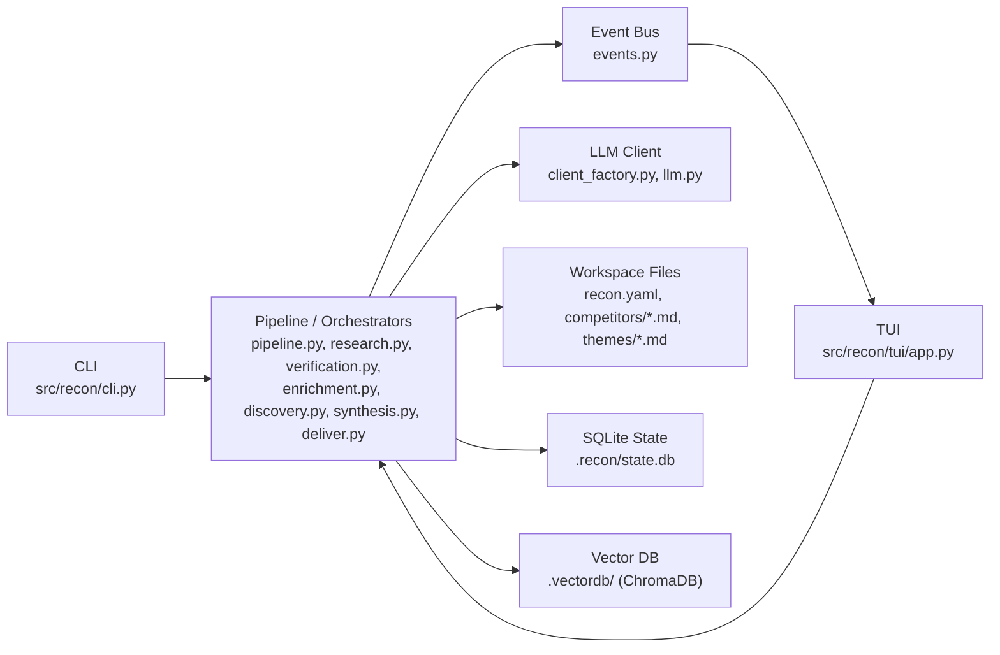
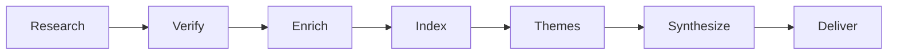
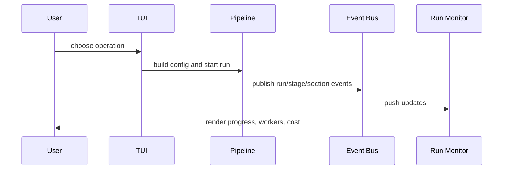

# How recon Works

This document explains the current architecture of `recon` as it exists in the codebase today.

At a high level, recon is a local-first competitive intelligence system with two front doors:

- a CLI built with Click
- a TUI built with Textual

Both interfaces drive the same async engine. The engine reads and writes markdown profiles in a workspace, persists run state and cost data in SQLite, and uses a local vector store for retrieval and theme discovery.

## System shape

## The main layers

### 1. Interface layer

The interface layer is intentionally thin.

- `src/recon/cli.py` exposes commands like `discover`, `research`, `verify`, `index`, `tag`, `synthesize`, and `run`.
- `src/recon/tui/app.py` and `src/recon/tui/screens/*` provide the interactive UI.

The key design decision is that the UI is not supposed to own business logic. The CLI and TUI mostly gather input, build config, and call engine modules.

### 2. Engine layer

The engine is a set of focused modules rather than one large service object:

- `pipeline.py`: end-to-end stage orchestration
- `research.py`: section-by-section research across competitors
- `verification.py`: multi-tier source verification
- `enrichment.py`: cleanup, sentiment, and strategic passes
- `index.py` and `incremental.py`: chunking, embedding, and indexing
- `themes.py`: clustering and theme discovery
- `tag.py`: apply discovered themes back to profiles
- `synthesis.py`: produce theme analyses
- `deliver.py`: distill syntheses and generate executive summary
- `discovery.py`: find competitor candidates

This layer is async-native and uses a worker pool for bounded concurrency.

### 3. Data layer

Recon is local-first. The workspace is the source of truth for user-visible artifacts.

- `recon.yaml`: schema and research configuration
- `competitors/*.md`: profile documents with YAML frontmatter + markdown body
- `themes/*.md`: theme synthesis outputs
- `themes/distilled/*.md`: distilled theme outputs
- `executive_summary.md`: final cross-theme summary
- `.recon/state.db`: run state, tasks, verification results, file hashes, cost history
- `.vectordb/`: ChromaDB persistence

## The core objects

### Workspace

`src/recon/workspace.py` owns workspace setup and profile file access.

Important behavior:

- `Workspace.init()` creates the directory structure
- `Workspace.open()` loads an existing workspace and schema
- `create_profile()` scaffolds a markdown profile
- `list_profiles()` and `read_profile()` are the main read APIs used across the engine

The workspace layer is deliberately simple. Most higher-level behavior lives elsewhere.

### Schema

`src/recon/schema.py` parses `recon.yaml` into typed Pydantic models.

The schema drives:

- which sections exist
- allowed output formats
- preferred output format
- source preferences
- search guidance
- verification tier per section

That means recon is schema-driven rather than hardcoding a fixed report structure inside prompts.

### LLM client

`src/recon/client_factory.py` creates the Anthropic async client, and `src/recon/llm.py` wraps it in `LLMClient`.

`LLMClient.complete()` centralizes:

- model selection
- timeout handling
- tool passing
- token accounting

This is the only place most engine modules need to know about the upstream API shape.

### State store

`src/recon/state.py` provides an async SQLite-backed `StateStore`.

It stores:

- runs
- per-run tasks
- verification results
- file hashes for incremental indexing
- cost history

The pipeline uses this store for run lifecycle and cost recording. The CLI `index` command also uses it for incremental indexing.

### Event bus

`src/recon/events.py` is a small synchronous in-process pub/sub system.

The engine publishes events like:

- run started / completed / failed
- stage started / completed
- section started / retried / failed
- cost recorded

The TUI subscribes to these events so it can update the run monitor without polling.

## Execution model

### Worker pool

`src/recon/workers.py` provides a semaphore-based `WorkerPool`.

Its job is simple:

- limit concurrency
- preserve input order in results
- turn per-item exceptions into structured results
- honor pause and cancel events

This is the concurrency primitive used by research and enrichment.

### Orchestration style

Recon does not run one competitor end-to-end and then move to the next. The research stage is intentionally section-batched:

1. research section A for all competitors
2. research section B for all competitors
3. continue through the schema

That pattern comes from `ResearchPlan.from_schema()` in `src/recon/research.py`. It improves comparability because all competitors get the same section researched in the same phase.

## Pipeline flow

The full engine pipeline lives in `src/recon/pipeline.py`.

### Stage 1: Research

`ResearchOrchestrator`:

- resolves target competitors
- builds a section-by-section plan from the schema
- composes prompts from schema data
- optionally uses Anthropic's web search tool
- writes section output directly into each profile markdown file
- updates `section_status` metadata in frontmatter

The research output is the first major artifact layer. Everything downstream builds on those markdown profiles.

### Stage 2: Verify

`VerificationEngine` supports three tiers:

- `standard`: mark sources as unverified, no extra LLM work
- `verified`: one verification pass
- `deep`: verification pass plus tie-breaker pass

The pipeline splits profile markdown into sections, extracts source URLs, and writes verification summaries back into profile frontmatter.

Important current-state note:

- the engine supports verification as a pipeline stage
- the dedicated `recon verify` CLI command uses it
- the current `recon run` CLI path and current TUI pipeline runner both set `verification_enabled=False`, so full runs currently skip the verify stage unless the user invokes verification separately

### Stage 3: Enrich

`EnrichmentOrchestrator` runs three passes over existing profile content:

- `cleanup`
- `sentiment`
- `strategic`

Unlike research, enrichment replaces the profile body with an improved version instead of appending a separate artifact.

### Stage 4: Index

There are two indexing paths in the codebase:

- `src/recon/incremental.py`: incremental indexer using file hashes in SQLite
- `Pipeline._stage_index()` in `src/recon/pipeline.py`: direct chunk-and-add indexing during full pipeline runs

Important current-state note:

- the standalone `recon index` command uses the incremental indexer
- the full pipeline currently uses the direct indexing path, not the incremental one

### Stage 5: Theme discovery

Theme discovery happens in `src/recon/themes.py`.

The process is:

1. build chunks from workspace profiles
2. strip citation-heavy source noise from chunk text
3. generate local embeddings with `fastembed`
4. cluster embeddings with k-means
5. label each cluster either mechanically or via LLM
6. generate suggested retrieval queries for each theme

The resulting theme objects are then passed to `Tagger` in `src/recon/tag.py`, which retrieves relevant chunks and writes theme labels back into profile frontmatter.

### Stage 6: Synthesis

`SynthesisEngine` turns a discovered theme plus retrieved chunks into a theme document.

Modes:

- single-pass
- deep 4-pass: strategist -> devil's advocate -> gap analyst -> executive integrator

Outputs are written to `themes/<slug>.md`.

### Stage 7: Deliver

`Distiller` and `MetaSynthesizer` in `src/recon/deliver.py` produce the executive layer:

- one distilled file per theme under `themes/distilled/`
- one cross-theme `executive_summary.md` at the workspace root

## How the TUI fits in

The TUI is a consumer of the engine, not a separate architecture.

Key files:

- `src/recon/tui/app.py`: application shell and mode switching
- `src/recon/tui/pipeline_runner.py`: maps TUI planner actions to `PipelineConfig`
- `src/recon/tui/run_monitor.py`: live monitor widgets driven by events
- `src/recon/tui/screens/*`: user flows

The TUI run flow is:

1. planner chooses an operation
2. `pipeline_runner.py` builds a `PipelineConfig`
3. `ReconApp.launch_pipeline()` switches to the run screen
4. `RunScreen` starts the async pipeline worker
5. engine events update the UI in real time

Important current-state note:

- `pipeline.py` supports an optional theme-curation callback
- the current TUI runner does not pass that callback, so discovered themes currently auto-flow into synthesis during a run

## Why the architecture is shaped this way

Three design choices define the system:

### Local-first artifacts

The valuable outputs are plain markdown files in the workspace, not opaque rows in a service database. That makes the tool easy to inspect, edit, diff, and open in Obsidian or a text editor.

### Schema-driven behavior

The schema is not just metadata. It controls sections, formats, and verification policy, which lets recon adapt to different research domains without rewriting engine logic.

### Thin interfaces over a reusable engine

The CLI, TUI, and any future UI can all target the same engine modules. That keeps the codebase from splitting into separate implementations of the same workflow.

## Practical file map

If you are new to the codebase, these are the fastest files to read first:

- `src/recon/cli.py`
- `src/recon/pipeline.py`
- `src/recon/workspace.py`
- `src/recon/schema.py`
- `src/recon/research.py`
- `src/recon/themes.py`
- `src/recon/tui/pipeline_runner.py`
- `src/recon/tui/app.py`

That sequence gets you from entrypoint, to orchestration, to storage, to the heaviest stage logic, to the UI bridge.
